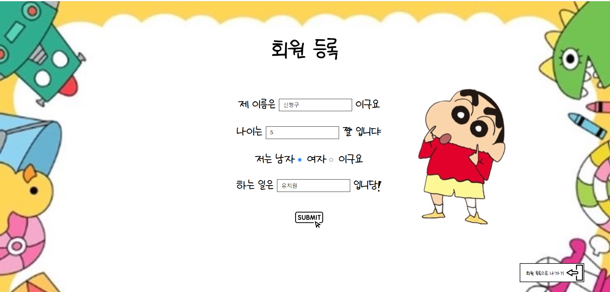
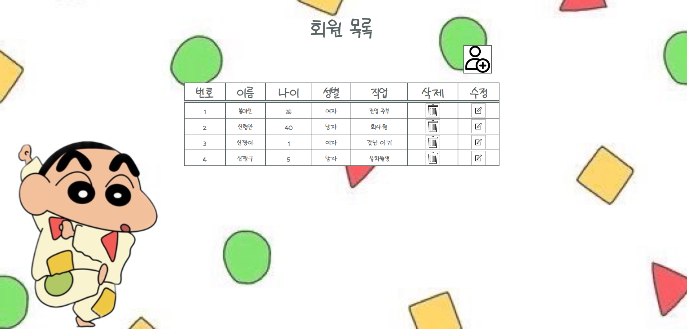
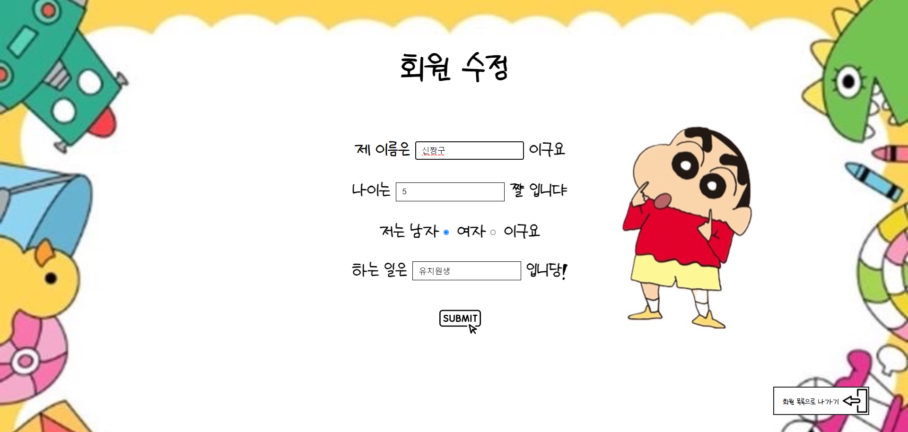
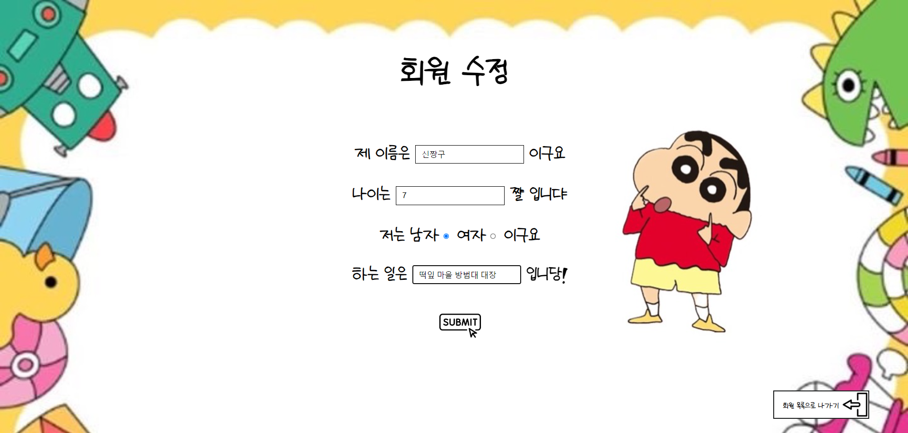
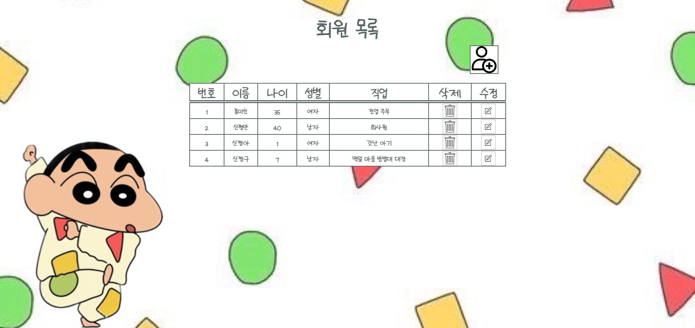
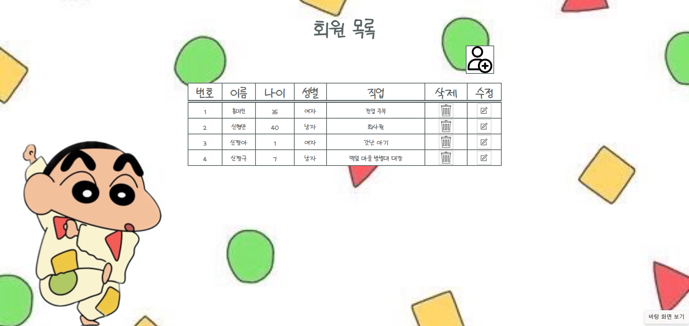
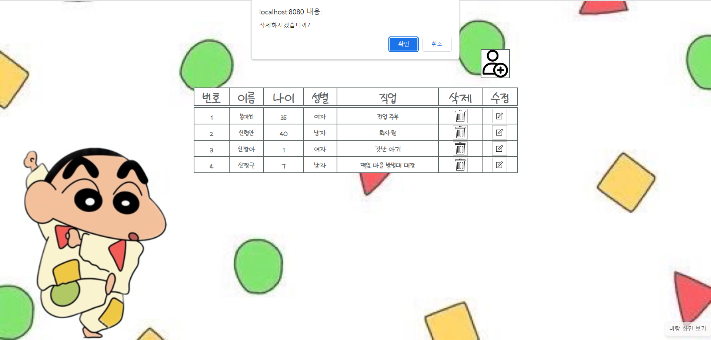
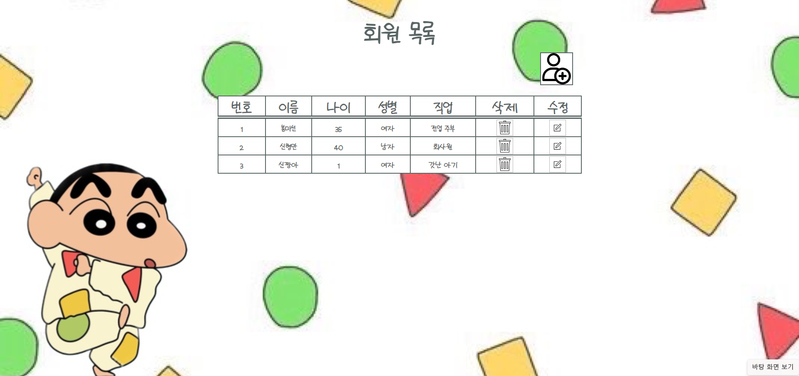

#  User Management

## 목차

-   프로젝트 소개

-  개발 기간

-  설명과 사용 방법

   - [회원 등록](#회원-등록)
 
   - [회원 수정](#회원-수정)

   - [회원 삭제](#회원-삭제)

## 프로젝트 소개
회원 정보를 조회, 추가, 수정, 삭제(CRUD) 할 수 있는 프로그램입니다.

##   개발 기간
2023.11.08 - 2023.11.30

##  설명과 사용 방법

### 회원 등록

1. **회원 등록 페이지**에서 이름, 나이, 성별, 직업을 입력하고 [submit] 버튼을 클릭합니다.

( * 페이지 오른쪽 하단의 **회원 목록으로 나가기 버튼**을 클릭하면 회원 목록 페이지로 이동합니다. * )

2. **회원 목록 페이지**로 이동되고 등록된 회원의 정보가 표의 하단에 순서대로 생성됩니다. 

( * 페이지 표 오른쪽 상단의 **회원추가 아이콘**를 클릭하면 회원 등록 페이지로 이동합니다. * )

### 회원 수정
1. **회원 목록 페이지**에서 수정하고싶은 회원의 [수정] 버튼을 클릭합니다.

2. **회원 수정 페이지**로 이동되고 수정 회원의 기존 정보가 페이지에 입력됩니다. 

( * 페이지 오른쪽 하단의 **회원목록으로 나가기 버튼**을 클릭하면 회원 목록 페이지로 이동합니다. * )

3. 수정하고 싶은 새로운 정보를 입력하고 [submit]버튼을 클릭합니다.

4. **회원 목록 페이지**로 이동되고 수정된 정보로 변경되어 나타납니다. 

### 회원 삭제

1. **회원 목록 페이지**에서 삭제하고 싶은 회원의 삭제 버튼을 클릭합니다.  

2. 삭제 요청을 확인하는 알림창이 나타나고 [확인]를 클릭합니다.

3. **회원 목록 페이지**에서는 삭제한 회원의 정보가 사라지게됩니다. 
